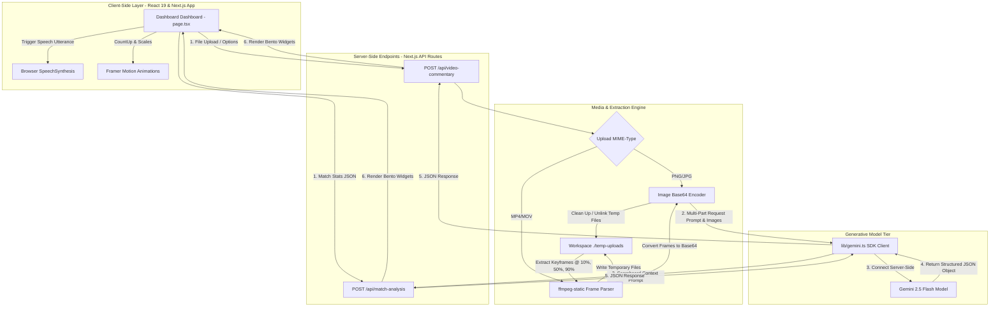

# CrickVoice AI: Multimodal AI Cricket Commentator & Match Emotion Predictor

CrickVoice AI is a premium, cinematic single-page web application that converts cricket match situations and video clips into rich, broadcast-style visual analytics and live vocal commentary. It features a stunning stadium-glowing dark theme and utilizes server-side **Gemini 2.5 Flash** models to deliver realistic television broadcast simulations.

---

## 🌟 What This Webapp Does

CrickVoice AI operates in **two distinct modes** to turn numbers and media files into realistic stadium atmospheres:

### 🎙️ Mode 1: Video Commentary Studio (Multimodal Mode)
*   **Media Drag & Drop**: Allows users to upload match clips (`MP4`, `MOV`) or match images (`PNG`, `JPG`) under 25MB and 30 seconds.
*   **Static FFmpeg Keyframe Extractor**: A platform-specific precompiled FFmpeg binary (`ffmpeg-static`) runs server-side on the backend. It automatically parses video duration and extracts three keyframes (Beginning at 10%, Middle at 50%, and End at 90%) to capture the sequence of play.
*   **Bypass Optimization**: Direct image uploads (`PNG/JPG`) automatically bypass FFmpeg and are sent instantly as a base64 inline block.
*   **Tone & Language Modulation**: The user can choose commentary styles (*Professional, IPL Excited, Hindi Commentary, Funny, Radio Style*) and language outputs (*English, Hindi*).
*   **Vocal Speech Synthesizer**: Utilizes the native browser Web Speech API (`SpeechSynthesis`) to read the AI commentary aloud at a professional broadcast tempo (1.05x speed) and pitch (0.95), accompanied by a pulsing visual audio equalizer.

### 📊 Mode 2: Match Situation Simulator (Analytical Mode)
*   **Stats Sandbox**: Users manually enter current match conditions: Current Score, Wickets Remaining, Required Runs, Balls Left, Current Run Rate ($CRR$), Batter Strike Rate, and Match Pressure Level.
*   **Auto-Calculated Rates**: The interface automatically calculates the Required Run Rate ($RRR$) dynamically as the user types runs and balls, keeping the workspace synced.
*   **Consistency Validation Rules**: Performs checks (e.g., checking if remaining wickets exceed available batters from the current score, and protecting against negative numbers) to ensure realistic simulations.
*   **Bento-Grid Dashboard Widgets**: Displays:
    *   **Excitement Circular Arc**: Captures count-up percentages and rating levels (*Nail-Biter*, *Thrilling*).
    *   **Tension Cardiac Indicator**: Shakes and pulsates to mirror high-stress crunch situations.
    *   **Tactical Dominance Tug-of-War**: Renders a split bar illustrating Batting vs. Bowling supremacy.
    *   **Suspense Neural Analyzer**: Evaluates volatility and unpredictability using animated waveforms.
    *   **Win Probability segments**: Segmented bar displaying exact chasing vs. defending chances.
    *   **Stadium Acoustics Badge**: Translates indices into ambient crowd states (*Explosive, Nervous, Chaotic, Silent*).
    *   **Live Prediction Oracle**: Summarizes the projected conclusion in one crisp golden sentence.

---

## 🏗️ System Design & Architecture



---

## 🛠️ Technology Stack

*   **Core**: Next.js 15 (App Router), React 19, TypeScript
*   **Styling**: Tailwind CSS, glowing linear spotlights, obsidian card overlays, custom range tracks, and glowing segmented bar sliders
*   **Animations**: Framer Motion (circular progress dashboard, pulse alarms, audio bar indicators, and typewriter effects)
*   **Video Processing**: Static FFmpeg Binary (`ffmpeg-static`)
*   **Model Integration**: Google Generative AI SDK (`@google/generative-ai`)
*   **Audio Synthesizer**: Native Client Web Speech Synthesis API

---

## 📁 Key Directory Structure

```bash
GDG-APL/
├── src/
│   ├── app/
│   │   ├── api/
│   │   │   ├── match-analysis/
│   │   │   │   └── route.ts         # Match Situation Simulator API Route (Gemini 2.5 Flash)
│   │   │   └── video-commentary/
│   │   │       └── route.ts         # Multimodal Video/Image Commentary API Route (FFmpeg + Gemini)
│   │   ├── layout.tsx               # Metatags, viewport, and SEO configurations
│   │   ├── page.tsx                 # Main Single-Page Dashboard (Tabs switcher, Drag/Drop, Bento Cards)
│   │   └── globals.css              # Custom stadium styles, spotlight grids, audio-bars, and animations
│   └── lib/
│       └── gemini.ts                # Reusable Google Generative AI SDK client wrapper
├── temp-uploads/                    # Temporary video processing folder (Auto-cleaned in CWD)
├── .env                             # Environment Credentials Template
├── package.json                     # Dependency manifests
└── README.md                        # Project technical guide (This file)
```

---

## ⚡ Setup & Local Execution

Follow these steps to launch the application immediately:

### 1. Configure the API Credentials
Create or edit the `.env` file in the root directory:
```bash
GEMINI_API_KEY=your_actual_gemini_api_key_here
```

### 2. Install Project Dependencies
In the project root folder, execute:
```bash
npm install
```

### 3. Start the Next.js Development Server
Start the local server with **Turbopack** optimization:
```bash
npm run dev
```
The server will boot up in under 2 seconds:
*   Local URL: **[http://localhost:3000](http://localhost:3000)**
*   Network URL: `http://[ip-address]:3000`

---

## 🔒 Security & Privacy

*   **Server-Side Calls Only**: The `GEMINI_API_KEY` is kept safe on the server and is never exposed to the client browser.
*   **Automatic Temporary Purges**: The `temp-uploads` directory operates entirely within the workspace boundaries. Extracted frames and uploaded videos are aggressively garbage-collected and unlinked immediately after the Gemini response is generated, preventing storage leaks and keeping video uploads private.
*   **Zero-Cost Audio**: Text-to-Speech runs client-side inside the user's browser, eliminating external voice hosting costs.
